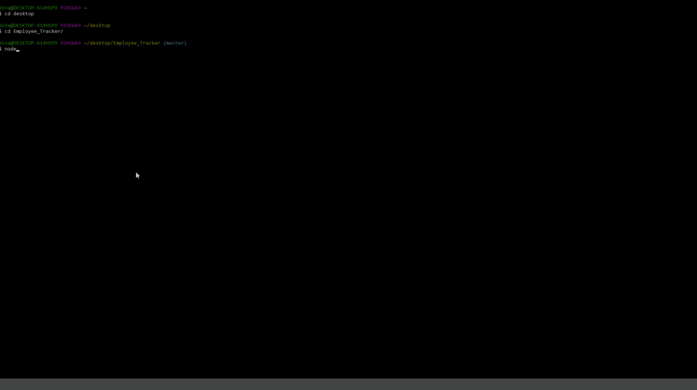

# Employee_Tracker

## Demo Video

[Video Demonstration of Application](https://drive.google.com/file/d/1WKQsZcAdrmydY0HYuznkeyeBtZdWpfyN/view)

## Description

This application runs through the command line and allows you to view and manage departments, roles, and employees. 

## Table of Contents

1. [Instructions](#instructions)
2. [License](#license)
3. [Contributing](#contributing)
4. [Questions](#questions)

## Instructions

First, make sure you have [Node.js](https://nodejs.org/en/) installed on your computer. Next, clone the repository to your computer. Once it's cloned, open the directory in your CLI and run "npm init" to create your package.json. Next, run "npm i" to install the dependencies. Following the "config.js.example", create a "config.js" file in your database folder with your MySQL login information. Now you can run the application using "node index.js".

## License

This application is covered under the MIT License.

## Contributing

Contributions are welcome. Please create a pull request with your changes for me to review.

## Questions

If you have further questions, please email me at nckoller@gmail.com.
